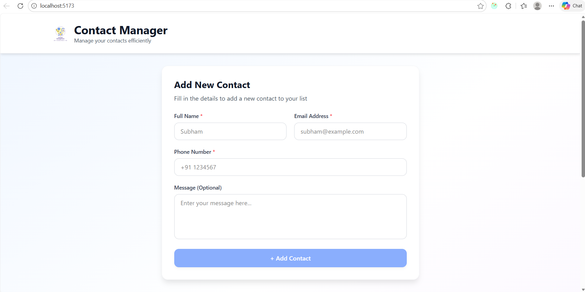
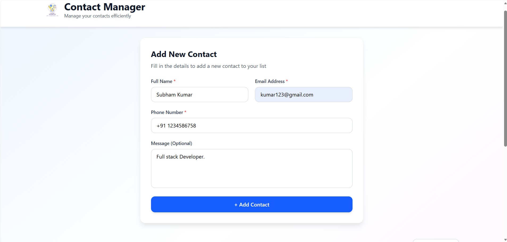
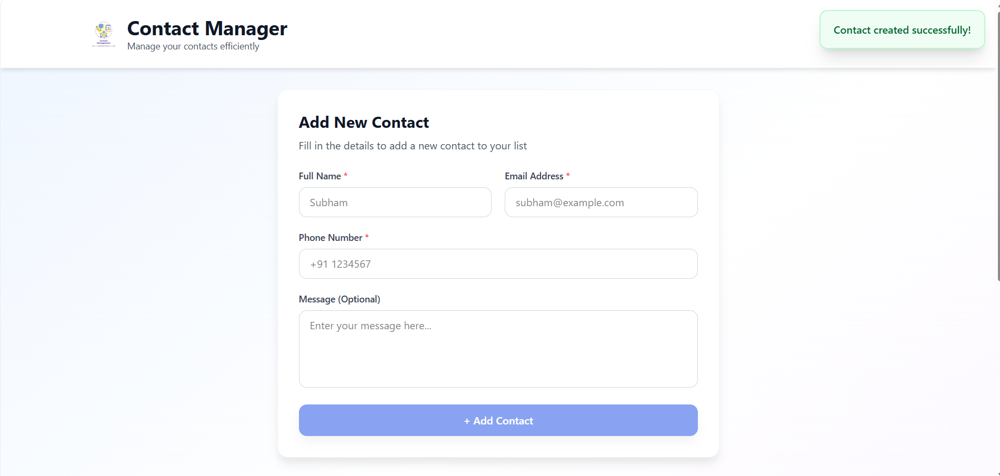
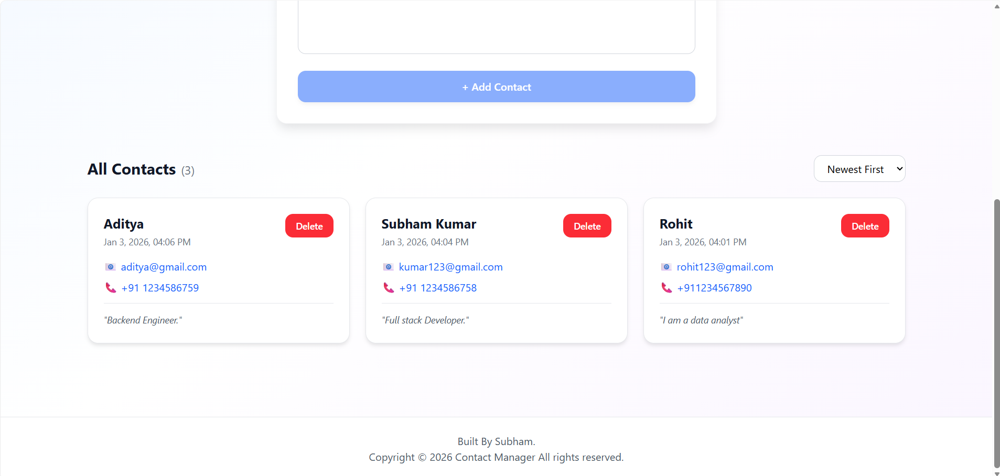

# Contact Manager – Smart Contact Organizer

Contact Manager is a modern, full-stack web application built with the MERN stack that enables users to efficiently manage their personal and professional contacts. Designed with a clean UI and real-time data handling, it provides essential CRUD operations with form validation, search functionality, and responsive design using Tailwind CSS.

## Why Contact Manager?
In our interconnected world, maintaining organized contact information is crucial for productivity and networking. Contact Manager addresses this need by offering:
​

- Simple & intuitive interface for quick contact management

- Real-time CRUD operations with instant feedback

- Client & server-side validation for data integrity

- Responsive design that works seamlessly across all devices

- RESTful API architecture for scalable and maintainable code

## **Problem Statement**

Traditional contact management solutions often face these challenges:

- Scattered contact information across multiple platforms and devices

- No validation mechanisms, leading to incomplete or incorrect data

- Poor user experience with cluttered interfaces and slow performance

- Lack of search functionality making it difficult to find specific contacts quickly

- No persistent storage, resulting in data loss

## **Solution Statement**
Contact Manager solves these issues by providing:

- Centralized MongoDB database for secure, persistent contact storage
​
- Real-time form validation with user-friendly error messages on both client and server

- Clean Tailwind CSS interface with consistent design patterns and smooth interactions

- Advanced search & filtering to quickly locate contacts by name, email, or phone

- RTK Query integration for efficient data fetching, caching, and state management

## Key Features

- Full CRUD contact management allowing users to create, view, and delete contacts with essential details.

- Responsive, mobile-first UI built using Tailwind CSS for consistent experience across devices.

- RTK Query–powered data fetching with automated caching, background refetching, and optimistic updates.

- Client-side form validation using regex patterns to ensure valid email and phone inputs.

- Sorting functionality to organize contacts by name (A–Z / Z–A) and creation date (newest / oldest).

- Real-time toast notifications for success and error feedback with auto-dismiss behavior.

- Robust RESTful API with structured endpoints and comprehensive frontend–backend error handling.

- Secure environment configuration using dotenv for managing sensitive application settings.

## Screenshots






## Project Structure
```
contact-manager/
├── client/                    # React frontend
│   ├── public/
│   │   └── index.html
│   ├── src/
│   │   ├── components/        # Reusable UI components
│   │   │   ├── ContactCard.jsx
│   │   │   ├── Input.jsx
│   │   │   ├── Textarea.jsx
│   │   │   └── Toast.jsx
│   │   ├── features/          # Redux slices & API
│   │   │   ├── api/
│   │   │   │   └── contactsApi.js
│   │   │   └── store.js
│   │   ├── lib/               # Utility functions
│   │   │   └── utils.js
│   │   ├── pages/             # Page components
│   │   │   ├── ContactForm.jsx
│   │   │   └── ContactList.jsx
│   │   ├── App.jsx
│   │   ├── main.jsx
│   │   └── index.css
│   ├── .env
│   ├── package.json
│   ├── tailwind.config.js
│   └── vite.config.js
│
├── server/                    # Node.js backend
│   ├── controllers/           # Route handlers
│   │   └── contactController.js
│   ├── database/              # Database connection
│   │   └── db.js
│   ├── models/                # Mongoose schemas
│   │   └── Contact.js
│   ├── routes/                # API routes
│   │   └── contactRoutes.js
│   └── index.js
│
├── package.json 
└── README.md
```
## Getting Started
### Prerequisites
- Node.js 18+

- MongoDB (local or Atlas)

- npm
### Frontend Setup
1. Clone the repository:
```bash
git clone https://github.com/Subham62/contact-manager.git
```
2. Navigate to the client directory:
```bash
cd client 
```
3. Install dependencies:
```bash
npm Install
```
4. Run the client:
```bash
npm run dev
```
### Backend Setup
1. Navigate to the server directory:
```bash
cd server 
```
2. Create a ```.env``` file in the server directory
```
PORT=5000
MONGO_URI=mongodb://localhost:27017/contact-manager
# Or use MongoDB Atlas:
# MONGO_URI=mongodb+srv://<username>:<password>@cluster.mongodb.net/contact-manager
NODE_ENV=development
```

3. Install dependencies:
```bash
npm Install
```
4. Run the server:
```bash
npm run dev
```
## Technologies Used
### Frontend

- React.js – Component-based UI library

- Redux Toolkit – State management with simplified Redux logic
​
- RTK Query – Powerful data fetching and caching tool

- Tailwind CSS – Utility-first CSS framework for rapid UI development

- Vite – Fast build tool and dev server

- JavaScript (ES6+) – Modern JavaScript features

### Backend

- Node.js

- Express.js

- MongoDB & Mongoose

## Contribution Guidelines
We welcome contributions to enhance and improve the application.
If you have ideas or improvements, feel free to submit a **pull request** following standard contribution practices.

## Feedback and Issues
If you encounter any issues or have feedback, please open an issue on the *GitHub* repository.
Your input helps improve Contact Manager with every update.

⭐ If this project helped you learn MERN stack development, consider starring this repository!

## Acknowledgments

- React and the open-source community for building a flexible frontend ecosystem
- Redux Toolkit for simplifying global state management
- Node.js and Express.js for a robust backend foundation
- MongoDB for flexible and scalable data storage